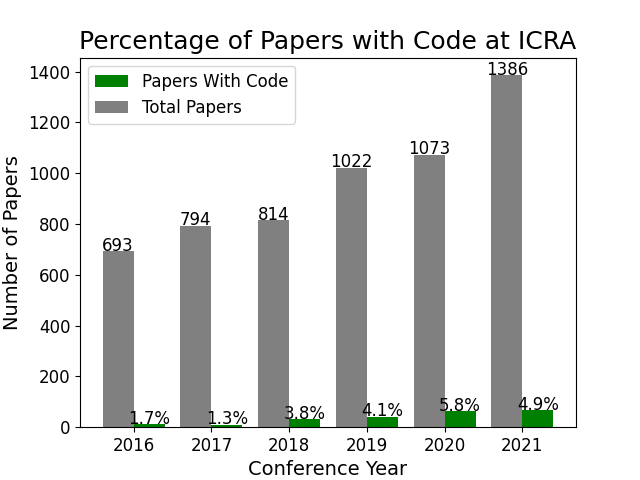

# code-release

This repository contains all the data and plotting scripts required to repoduce the plots in our paper [*TBD Title*](http://)

## Installation

Install/upgrade Python3 dependencies:

```sh
pip3 install --upgrade pip
pip3 install pyyaml
pip3 install tikzplotlib
pip3 install matplotlib --upgrade
```

This was tested on macOS 13.3 with:

```sh
anaconda                  2022.10  
matplotlib                3.7.1
pip                       23.0.1
python                    3.9.13 
pyyaml                    6.0
tikzplotlib               0.10.1
```

## Use

Clone this repository and run its `main.py` script:

```sh
git clone https://github.com/utiasDSL/TBD.git
cd TBD/
python3 main.py
```

## Output

The script will sequentially generate the following figures:





## Contribution

Our determination of available open-source code for publications is not perfect. If we incorrectly associated your publication with or without code, please open a pull request with the correction. We appreciate your contributions! 

## Citation

Please cite our work [(link)](https://) as:

```bibtex
@INPROCEEDINGS{tbd,
      title={TBD}, 
      author={Name Surname and Angela P. Schoellig},
      booktitle={TBD},
      year={2023},
      volume={},
      number={},
      pages={},
      doi={}
}
```

-----
>  [Learning Systems and Robotics Lab](https://www.learnsyslab.org/) at the Technical University of Munich (TUM) and the University of Toronto
